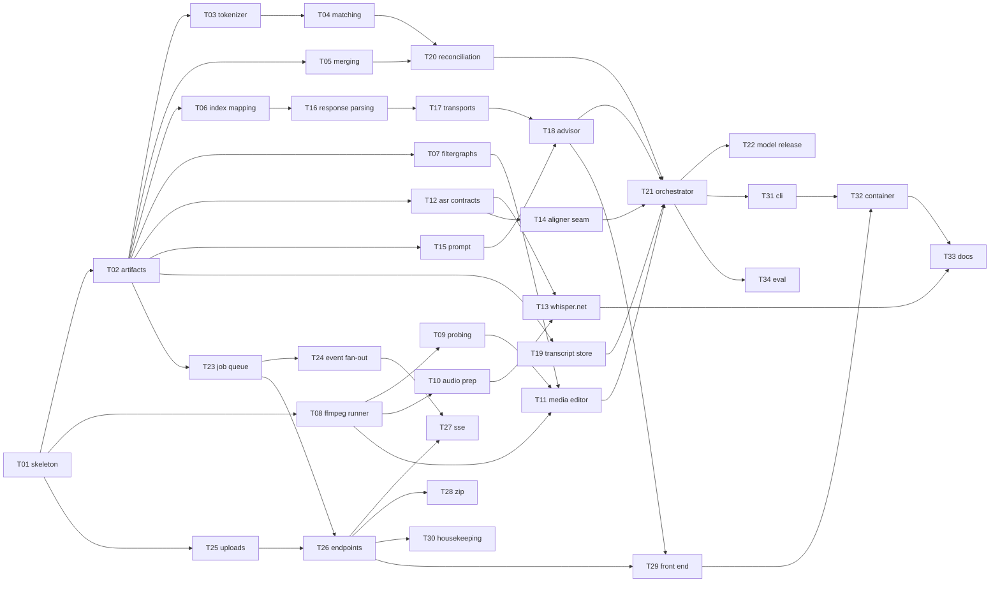

# 03 — Parallelisation Review

A pass back over [02-task-breakdown.md](02-task-breakdown.md) asking: what
actually blocks what, and what can proceed at the same time?

---

## 1. Dependency graph

## 2. The critical path, and a way to shorten it

As written, the longest chain is **ten tasks deep**:

> T01 → T02 → T06 → T16 → T17 → T18 → T21 → T31 → T32 → T33

The striking part is *where* it runs. Smart Cut — an optional feature that is
currently dead code in the Python app — sits on the critical path, because T21
lists T18 as a dependency. The ASR work, which carries all the actual technical
risk, does not.

That dependency is an artifact of how I wrote the breakdown, not a real
constraint. **T21 needs the `ISmartCutAdvisor` *interface*, not the Gemini
client.** The same is true of `ITranscriber`, `IAligner` and the media editor:
the orchestrator is written against contracts and tested entirely with stubs,
which is the whole point of the layering.

### Recommended change: hoist the contracts into T02

Split T02 into artifacts *and* the interface set — `ITranscriber`, `IAligner`,
`ISmartCutAdvisor`, `IMediaEditor`, `IMediaProber`, `ITranscriptStore`,
`IProgressSink`. Nothing but signatures and records.

The effect:

| | Before | After |
|---|---|---|
| Critical path | 10 tasks | **9 tasks** |
| T21 blocked by | T11, T14, T18, T19, T20 | T19, T20 |
| Fully independent work streams | 3 | **6** |

T21 — the largest and most design-heavy task — moves from "blocked until three
engine tracks finish" to "startable as soon as matching and merging land". The
engines then plug in behind interfaces that already have passing stub-based
tests describing exactly what they must do.

This is worth doing regardless of whether anything runs in parallel: it means
the hardest piece of new design gets written early, while there is still room
to react to what it teaches.

## 3. Independent work streams

With contracts hoisted, six streams touch disjoint sets of files:

| Stream | Tasks | Projects touched | Blocked by |
|---|---|---|---|
| **A · Domain rules** | T03, T04, T05, T06, T20 | `Domain` | T02 |
| **B · Media** | T07, T08, T09, T10, T11 | `Media` | T02 (T08 only needs T01) |
| **C · Transcription** | T12, T13, T14 | `Transcription` | T02, and T10 for T13 |
| **D · Smart Cut** | T15, T16, T17, T18 | `SmartCut` | T02, and T06 for T16 |
| **E · Jobs & Web** | T23, T24, T25, T26, T27, T28, T30 | `Jobs`, `Web` | T02 |
| **F · Pipeline** | T19, T21, T22 | `Pipeline` | T02, and A for T21 |

Only two edges cross streams: **T06 → T16** (Smart Cut parsing reuses the
domain index mapper) and **T10 → T13** (the transcriber needs audio cropping).
Both are single, early, well-defined handoffs rather than ongoing coupling.

Stream E is the largest and the most independent — the entire web tier can be
built against a stubbed pipeline without any of A, B, C or D existing.

## 4. Execution waves

| Wave | Runs | Parallelism |
|---|---|---|
| **0** | T01, T02 | **Serial.** Everything touches these files. |
| **1** | A: T03→T04, T05, T06 · B: T08→T09/T10, T07 · C: T12→T14 · D: T15 · E: T23→T24, T25 · F: T19 | **6-wide** |
| **2** | A: T20 · B: T11 · C: T13 · D: T16→T17→T18 · E: T26→T27/T28/T30 | **5-wide** |
| **3** | F: T21 | Serial (the integration point) |
| **4** | T22, T29, T31, T34 | 4-wide |
| **5** | T32 | Serial |
| **6** | T33 | Serial |

Wave 3 is a genuine convergence point and there is no honest way around it —
T21 is where every stream's contract gets exercised together for the first
time. Waves 5 and 6 are packaging and cannot be split either.

## 5. Making parallel work safe

The streams only stay independent if they stop colliding on shared files.
Three practical measures:

1. **T01 creates all sixteen projects empty**, registers them in `.slnx`, and
   pre-declares every NuGet package version in `Directory.Packages.props`.
   Otherwise every stream's first commit edits the solution file and the
   package list, and those are exactly the files that conflict worst. This is a
   small change to T01 and it removes nearly all the merge risk.

2. **Freeze the contracts at the end of Wave 0.** Six streams writing test
   doubles against the same interfaces means an interface change is six
   streams' worth of churn. If a contract turns out to be wrong — likely at
   least once — change it as its own task with its own commit rather than
   inside whichever stream noticed.

3. **One branch per stream, merged per task.** Each task is still its own
   commit, as specified; the branches just keep concurrent streams from
   stepping on each other's working tree.

## 6. What this is actually worth

An honest caveat: if I execute these tasks myself, one after another, the
dependency analysis buys **ordering freedom, not wall-clock speed**. Its real
value in that mode is that it says which tasks are safe to reorder when
something turns out harder than expected, and it surfaces the T18-on-the-
critical-path problem, which is worth fixing either way.

The parallelism becomes real speedup only if the streams run concurrently —
separate agents on separate branches. Streams A, B, D and E are the good
candidates: each is self-contained, each has its assertions largely pre-written
in the Python suite, and each touches one project. Streams C and F are poor
candidates — C carries the unresolved ASR risk and F is the integration point
where judgement calls concentrate.

## 7. Recommended order

1. **T01 + T02 with contracts hoisted** — serial, gets the shared files settled.
2. **Stream A**, then **T19 + T20 + T21** — the orchestrator early, against
   stubs, while the design is still cheap to change.
3. **Streams B, D, E** in whatever order suits — or concurrently.
4. **Stream C** last of the engine tracks. It has the only real unknown, and by
   then T21's stubs will have documented precisely what `ITranscriber` must do,
   which is the best possible spec to write a risky adapter against.
5. Packaging and docs.

The one change this review recommends to the plan itself: **hoist the contracts
into T02**, and have T01 scaffold all sixteen projects up front.
